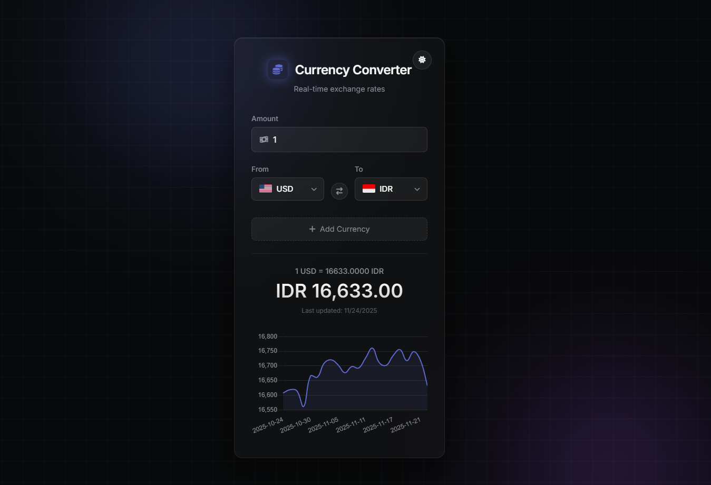

# Modern Currency Converter

A sleek, real-time currency converter application featuring a **Linear-style dark theme**, historical charts, and multi-currency support. Built with vanilla HTML, CSS, and JavaScript. Now fully installable as a PWA!



## 🚀 Features

-   **Real-time Conversion**: Instantly converts amounts as you type.
-   **Live Exchange Rates**: Uses the [Frankfurter API](https://www.frankfurter.app/) for up-to-date rates.
-   **📈 Historical Charts**: View 30-day exchange rate trends with interactive charts (powered by Chart.js).
-   **🌍 Multi-Currency Support**: Convert to multiple currencies simultaneously.
-   **🌓 Light/Dark Mode**: Toggle between a sleek dark theme and a clean light theme.
-   **📱 PWA Support**: Installable on mobile and desktop devices with offline capabilities.
-   **Modern Design**: Glassmorphism aesthetic with subtle animations.

## 🛠️ Technologies Used

-   **HTML5**: Semantic structure.
-   **CSS3**: Custom variables, Flexbox, Glassmorphism, Animations.
-   **JavaScript (ES6+)**: Async/Await, Fetch API, DOM Manipulation.
-   **Chart.js**: For rendering historical data charts.
-   **FontAwesome**: For icons.

## 📦 Setup & Usage

1.  Clone the repository:
    ```bash
    git clone https://github.com/dimasu21/currency-converter.git
    ```
2.  Open `index.html` in your browser.
3.  **Install as App**: Look for the install icon in your browser's address bar (Chrome/Edge) or "Add to Home Screen" on mobile.

## 📄 License

This project is open source and available under the [MIT License](LICENSE).
